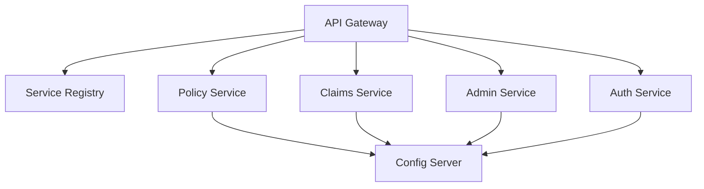

# SmartSecure Insurance Management System


SmartSecure is a robust, enterprise-grade Microservices-based Insurance Management System designed for high scalability, reliability, and security. It handles various aspects of the insurance lifecycle, including policy management, claim processing, and administrative oversight.

---

## 🏗️ System Architecture

The project follows a modern microservices architecture pattern, utilizing Spring Cloud components for service discovery, configuration management, and routing.



### Core Services
- **Service Registry (Eureka)**: Centralized service discovery for all microservices.
- **Config Server**: Externalized configuration management using a Git-based or file-based approach.
- **API Gateway**: Unified entry point for all client requests, providing intelligent routing and security.
- **Auth Service**: Handles authentication and authorization using JWT tokens.
- **Policy Service**: Manages insurance policies, coverage, and renewals.
- **Claims Service**: Orchestrates the claim submission and processing workflow.
- **Admin Service**: Provides administrative oversight and system management capabilities.

---

## 🚀 CI/CD Pipeline

The project features a fully automated CI/CD pipeline powered by **GitHub Actions**.

### Pipeline Stages
1. **Build & Test**: Automatically builds every service using Maven and runs unit tests on every push.
2. **Analysis (Local)**: High-quality code metrics are maintained using **SonarQube**. Due to the local nature of quality gates, analysis is performed using dedicated scripts.
3. **Dockerization**: Automatically builds Docker images for all services, ensuring they are ready for containerized deployment.

---

## 🛠️ Local Development & Automation

We provide several PowerShell scripts to automate local development workflows:

- `run-pipeline.ps1`: Mimics the entire CI/CD pipeline locally, performing clean builds for all services sequentially.
- `run-sonar.ps1`: Executes full SonarQube analysis for the entire microservices suite and generates a consolidated report.
- `docker-compose.yml`: Orchestrates the entire ecosystem, including infrastructure components like PostgreSQL, RabbitMQ, and Redis.

### How to Run Locally

1. **Prerequisites**: Ensure you have Java 17, Maven 3.9+, and Docker Desktop installed.
2. **Build the System**:
   ```powershell
   ./run-pipeline.ps1
   ```
3. **Launch Infrastructure & Services**:
   ```bash
   docker-compose up --build
   ```
4. **Run Quality Analysis**:
   ```powershell
   ./run-sonar.ps1
   ```

---

## 🛡️ Security & Quality
- **JWT Authentication**: Secured endpoints using standard JSON Web Tokens.
- **SonarQube Integration**: Comprehensive code quality and security hotspot analysis.
- **Standardized Error Handling**: Unified exception responses across all microservices for a better client experience.

---

Designed with ❤️ for Advanced Insurance Management.
